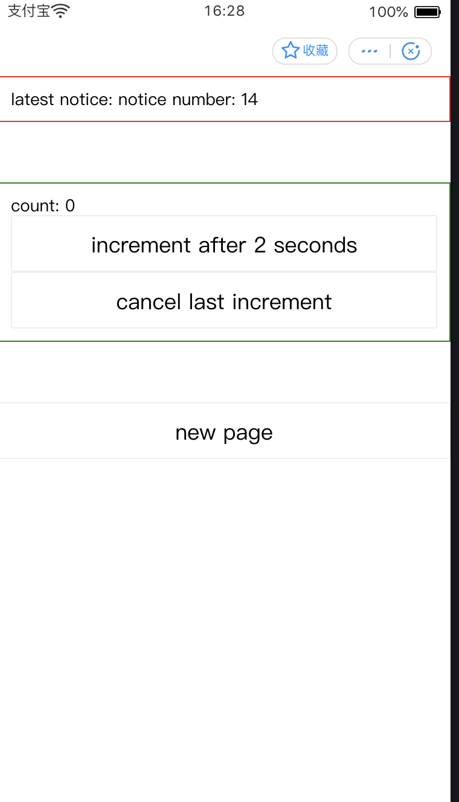

# 小程序多 store 示例

## 示例说明

组件包括上部通知组件以及中部点击计数组件

- 页面可多实例，每个页面实例存在自己的通知组件实例和点击计数组件实例

- 通知组件使用全局 store，可以在多个页面间不同组件实例同步状态

- 点击计数组件使用自身页面 store，可以在同一页面间不同组件实例同步状态，不同页面间不同组件实例状态隔离。

- 点击计数组件异步更新计数，可在中途取消计数

- new page 可产生新的页面实例，返回销毁当前页面实例

## 代码结构

框架依赖： redux, immer,redux-immer, redux-saga

- components/: 组件定义

- connect/: 连接 redux store 与组件实例的工具，兼容 store 数据变化触发组件渲染

- pages/: 页面定义

- store/global/reducers: 全局 store 通知 reducer 定义

- store/global/sagas: 全局 store 对应异步逻辑处理

- store/global/index: 整合 reducer，sagas 产生全局 store

- store/index/reducers: index 页面级别 reducer 定义

- store/index/sagas: index 页面级别 store 对应异步逻辑处理

- store/index/index: 整合 reducer，sagas 产生 index 页面级别 store, 每个页面实例对应不同的 store 实例
